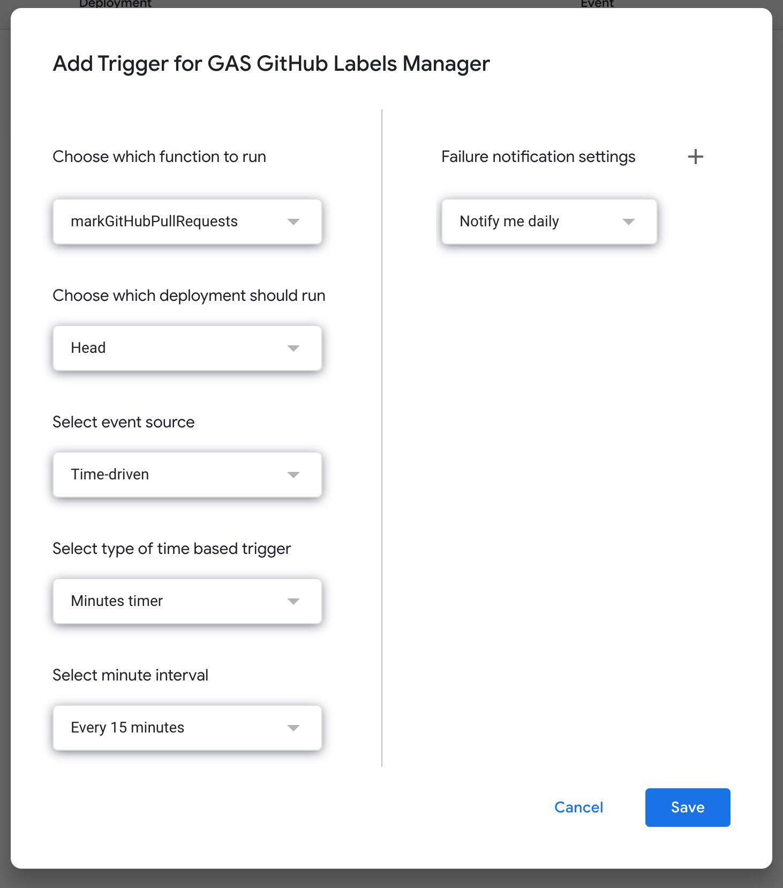

# gas-github-labels

GAS GitHub Labels Manager

A lightweight, zero-dependency automation tool built on Google Apps Script to synchronize, create, and manage your GitHub repository labels. It allows you to maintain consistent label sets across projects without leaving the Google environment or touching the command line.

## How to use

1. Go to [script.google.com](https://script.google.com) and create a **New Project**.
2. Paste the code from `Code.gs`.
3. Click **Run**.

## Automation (Cron)

To make it run automatically:
1. Click the **Triggers** (clock icon) on the left sidebar.
2. Click **+ Add Trigger**.
3. Choose the function to run and set the event source to **Time-driven**.
4. Set your preferred schedule (e.g., every hour or once a day).

## License

Licensed under the Apache License, Version 2.0.
