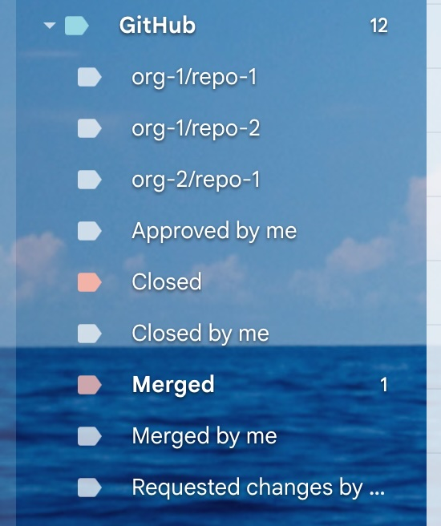

# 🏷️ GAS GitHub Labels Manager

A lightweight, zero-dependency automation tool built on Google Apps Script to synchronize, create, and manage your GitHub notification labels in Gmail.

## ✨ Features

* **Smart Hierarchy:** Automatically creates a nested label structure: `GitHub/Organization/Repository`.
* **PR Status Tracking:** Labels emails as `Merged` or `Closed`.
* **Personal Activity Detection:** Distinct labels for actions performed by **you**:
    * `Closed by me`
    * `Merged by me`
    * `Approved by me`
    * `Requested changes by me`
* **Dynamic Repository Discovery:** Automatically detects and creates labels for new repositories as you receive notifications.
* **Persistent Styling:** Once a label is created, you can change its color in Gmail, and the script will preserve your choice as long as the label exists.

## 🚀 How to Use

1. Go to [script.google.com](https://script.google.com) and create a **New Project**.
2. Paste the code from `Code.gs`.
3. Click **Run** to authorize the script.

## ⏰ Automation (Cron)

To make it run automatically:
1. Click the **Triggers** (clock icon) on the left sidebar.
2. Click **+ Add Trigger**.
3. Choose the `markGitHubPullRequests` function.
4. Set the event source to **Time-driven**.
5. Set the interval (e.g., every 5 or 10 minutes).

### 📧 Gmail Inbox Result
This is how your inbox will look with automatic repository and status labels:

## 🛠️ Logic Details

The script scans emails from the last hour and analyzes hidden technical headers:
- `X-GitHub-PullRequestStatus`: To determine if a PR is closed or merged.
- `X-GitHub-Reason`: To detect if the notification was triggered by your activity.
- `List-Archive`: To extract the organization and repository name.

## 🐞 Bug Reports

Found a bug or have a feature request? Please open an issue:
[https://github.com/varvashenya/gas-github-labels/issues](https://github.com/varvashenya/gas-github-labels/issues)

## 📄 License

Licensed under the Apache License, Version 2.0.
